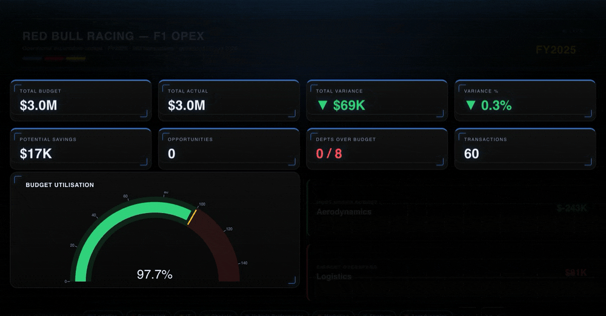

<h1 align="center">Red Bull Racing F1 — OPEX Analysis Pipeline</h1>

<!-- Hero: animated GIF (dashboard.gif) capturing the live cockpit load — KPI count-up + gauge. -->
<p align="center">
  
</p>

> Turn raw F1 operating spend into an executive cockpit — variance, overspends, and recoverable savings — in two formats from one typed analysis.

<p align="center">
  <a href="https://github.com/Felixsavedra-1/redbullracing-opex/actions/workflows/ci.yml"></a>
  
  
  
</p>

F1 teams run complex, multi-department budgets across hundreds of monthly transactions. This pipeline ingests (or generates) OPEX data and flags overspends and duplicate payments, then produces two executive-ready deliverables from one typed analysis — a branded **Excel workbook** and a self-contained interactive **HTML dashboard**, both opening on a cockpit view.

## Highlights

- **Two renderers, one analysis** — Excel and interactive HTML are independent presentation layers over the same typed outputs; adding a format never touches business logic.
- **Typed end-to-end** — `TypedDict` on every pipeline output, validated by `mypy --strict` with **zero suppressions**, so type errors surface at dev time, not runtime.
- **Self-contained dashboard** — one `f1opex_dashboard.html` with plotly.js inlined; opens offline in any browser with full hover/zoom interactivity.
- **Honest failures** — a custom exception hierarchy with distinct exit codes (1 = expected error, 2 = bug) and boundary column validation before any computation runs.
- **CI-verified** — black, `mypy --strict`, and **21 tests** run on Python 3.11 and 3.12 on every push.

**Stack:** Python 3.11 · pandas · numpy · xlsxwriter · plotly · pytest · mypy (strict) · black

## Quickstart

```bash
python3 -m venv venv && source venv/bin/activate
pip install -r requirements.txt
python3 main.py
```

Default: 500 synthetic records, year 2025, seed 42 → `opex_analysis_report.xlsx` + `f1opex_dashboard.html`.

---

<details>
<summary><b>Interactive HTML dashboard</b></summary>

<br/>

`f1opex_dashboard.html` — a single self-contained file (plotly.js inlined, opens offline in any browser) with an animated Red Bull sci-fi HUD theme:

- **8 KPI tiles** that **count up on load** — total budget, actual, variance $/%, potential savings, opportunities, depts over budget, transactions — color-coded red ▲ over / green ▼ under budget
- **Budget-utilisation gauge** (actual ÷ budget, green/red zone at 100%) plus **most-under-budget / biggest-overspend** callouts
- **Budget vs. Actual** grouped bars · **spend-mix donut** (with total in the center) · **monthly trend** line · **department variance ranking** (diverging red/green bars — who's over budget at a glance)
- **Department filter chips** — toggle departments to re-render every chart **and recompute the KPIs live**
- **Per-chart view tabs** — swap budget/variance between **$ and %**, and the monthly trend between **monthly and cumulative**
- **Click-to-expand savings cards** — drill into the exact flagged transactions behind each opportunity
- Staggered entrance motion, animated scanline/glow background, telemetry sweep (respects `prefers-reduced-motion`)
- Fully interactive: hover for exact figures, zoom, pan

</details>

<details>
<summary><b>Excel output</b></summary>

<br/>

| Sheet | Contents |
|---|---|
| **Dashboard** | Branded Red Bull cockpit · 8 KPI cards (budget, actual, variance $/%, savings, opportunities, depts over budget, transactions) · spend-mix donut · Budget vs Actual and monthly-trend charts |
| Executive Summary | Department spend vs. budget · Budget vs Actual and Variance % column charts · variance data bars · red/green conditional formatting |
| Savings Opportunities | High-variance outliers (>50% + $5K threshold) · duplicate payment groups · total potential savings |
| Monthly Trends | Budget vs actual line chart · top 10 expense types horizontal bar chart |
| Detailed Data | Full transaction table · currency and percentage formatting · frozen header |

</details>

<details>
<summary><b>CLI &amp; all flags</b></summary>

<br/>

```bash
python3 main.py [--records 500] [--year 2025] [--seed 42] [--no-anomalies] [--verbose]
               [--report-path FILE] [--html-path FILE] [--no-html]
```

```
09:01:12 [INFO] Generating 500 synthetic records for 2025…
09:01:12 [INFO] Running variance analysis…
09:01:12 [INFO] Found 8 department(s), 2 savings opportunities, -2.3% total variance
09:01:12 [INFO] Report written → opex_analysis_report.xlsx
09:01:12 [INFO] HTML dashboard written → f1opex_dashboard.html
```

</details>

<details>
<summary><b>Architecture &amp; data flow</b></summary>

<br/>

```
main.py            CLI orchestrator — arg parsing, logging, per-step timing
data_generator.py  Synthetic OPEX transactions → DataFrame (seeded, reproducible)
constants.py       Single source of truth for all thresholds, colors, and defaults
exceptions.py      Typed exception hierarchy: OpexError → DataGenerationError | ValidationError | ReportError | DashboardError
analysis.py        Variance metrics, department rollup, monthly trends, KPI summary, savings detection
excel_reporter.py  5-sheet .xlsx workbook: cockpit Dashboard + detail sheets, 7 styled charts
html_dashboard.py  Animated Plotly HTML cockpit (count-up KPIs, gauge, 4 charts, dept filter, drill-downs), self-contained / offline
```

Data flows in one direction:

```
generate_opex_data()
  → calculate_variance()
  → analyze_department_spending() + identify_savings_opportunities()
    + compute_monthly_trend() + compute_kpis()
  → create_excel_report()      → opex_analysis_report.xlsx
  → write_dashboard()          → f1opex_dashboard.html
```

</details>

<details>
<summary><b>Engineering deep-dive</b></summary>

<br/>

- **Cockpit-first reporting** — analysis *computes* (`compute_kpis` → typed `KpiSummary`), the reporter *renders*; the Dashboard is a pure presentation layer whose charts reference other sheets' ranges, so no data is duplicated
- **One chart styler per renderer** — a single `_style_chart()` (Excel) / `_style()` (HTML) helper enforces a consistent, de-cluttered Red Bull look across every chart; styling lives in one place, not per-chart
- **Two renderers, one analysis** — Excel (`excel_reporter.py`) and interactive HTML (`html_dashboard.py`) are independent presentation layers over the same typed analysis outputs; adding a format never touches business logic
- **Typed end-to-end** — `TypedDict` for all pipeline outputs, `cast()` for pandas interop, `mypy --strict` with zero suppressions; type errors surface at development time, not runtime
- **Custom exception hierarchy** — `OpexError` base with typed subclasses; expected failures exit 1, unexpected crashes exit 2, so callers can distinguish recoverable errors from bugs
- **Centralized constants** — all thresholds, colors, and defaults in `constants.py`; changing a detection threshold is a one-line edit with no grep required
- **Vectorized RNG** — `numpy.random.default_rng(seed)` makes every synthetic dataset fully reproducible across platforms and Python versions
- **Fail-fast column validation** — `_validate_columns()` guards every pipeline stage before any computation runs; bad data is rejected at the boundary, not mid-aggregation
- **Per-step timing** — `TimerContext` context manager profiles each phase without cluttering business logic; visible with `--verbose`
- **21 tests** — variance math, rollup correctness, KPI aggregation, anomaly detection, date bounds, schema validation, Excel structure (5 sheets / 7 charts) via `zipfile`, and HTML dashboard content (branding, KPI tiles, chart divs, self-contained bundle, interactive scaffolding)

</details>

<details>
<summary><b>Testing</b></summary>

<br/>

```bash
pytest -v   # 21 tests
```

CI runs black (format check), `mypy --strict`, and the full suite on Python 3.11 and 3.12 on every push and pull request.

</details>

---

<p align="center">
  
</p>
